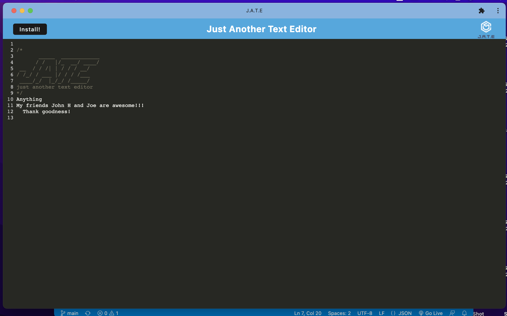

# 19_PWA-TextEditor
Challenge focuses on Progressive Web Applications utilizing and IndexedDB database. 

## Product Description
The PWA: Text Editor is a web application that uses indexdb to create a database in the local storage, as well as the manifest plugin.  This plugin makes the application modular.  It compiles all the data and folders for quicker performance.  

## Table of Contents
- [Utilize the Challenge](#utilize-the-challenge)
- [Screenshot](#screenshot)
- [Heroku Link](#heroku-link)
- [Acknowledgements](#acknowledgements)
- [Contact Me](#contact-me)

## Utilize the Challenge
To run this program you can do one of two things, you can go to the heroku app, ( https://arcane-mesa-59397.herokuapp.com/), you can open up the integrated terminal.  Run build the project.  Then npm run start to open the application on local host 3000.  You can open this on an open browser.  It will prompt you to install in which a new application is applied to your computer.  I opened up chrome apps and opened J.A.T.E.  From this moment, you can enter in text and it is stored in your local indexdb in the application area of the webpage.  

## Screenshot

## Heroku Link
[Heroku Link]( https://arcane-mesa-59397.herokuapp.com/)

## Acknowledgements
A huge thank you to the Veronica the Amazing TA and the other instructional staff, John and Don, in our UCF Bootcamp class. I relied heavily on our start-up video in which she described and gave us input as to what to do.  
I referenced module 28- the mini-project and lesson 26.  

## Contact Me
- [Github Link](https://github.com/CanRo2B)
- [Github Challenge Link](https://github.com/CanRo2B/19_PWA-TextEditor)
- [Heroku Link](https://arcane-mesa-59397.herokuapp.com/)
- [Email](mailto:hofe36@hotmail.com)